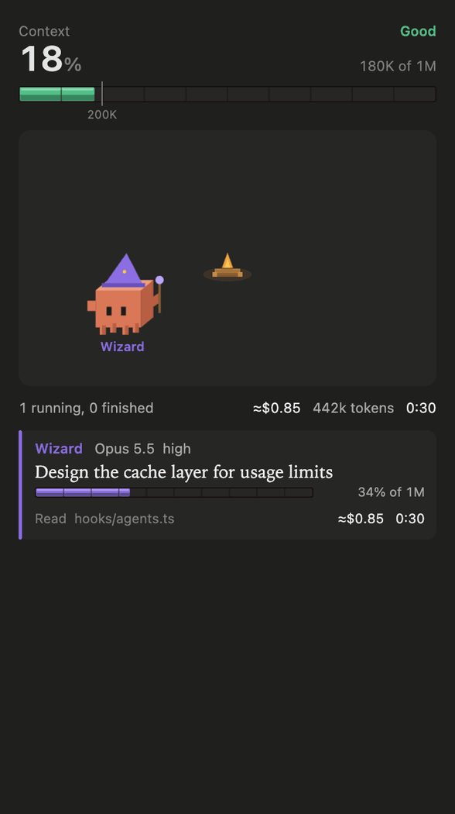

<p align="center">
  
</p>

<h1 align="center">Session HUD</h1>

<p align="center"><code>session-hud</code> shows your context, spend, usage limits and repo status in RPG gauges, and your subagents as a fantasy party around a campfire.</p>

<p align="center">
  <a href="https://claude.com/claude-code"></a>
  
  
  <a href="LICENSE"></a>
</p>

<p align="center"><sub>Works in the terminal and in the Claude desktop app's Code tab. Type <code>/hud</code> to show or hide the pane.</sub></p>

## What it shows

**Above the prompt** (always on; in a narrow desktop band the branch and then the model give way first):
- the context window as a gauge, its percentage and a status from Good to Critical
- the session cost and the model
- the git branch, when there is one
- your 5-hour and weekly usage, shown as `—` until the API first reports them
- a button that opens the side pane

**In the side pane** (`/hud` opens or closes it):
- **Context:** a gauge with a tick every 10% of the window. On windows larger than 200K, a notch marks 200K tokens.
- **Stats:** the amount spent, the time elapsed, and the tokens in and out
- **Limits:** each usage limit the API reports, such as the 5-hour and weekly windows
- **Repo:** the model, the branch, and the staged, modified and new files, with +/− lines
- **Agents:** the subagents as a party around a campfire, then a list of what each one is doing

Every bar is a framed gauge. Its colour is a gem that changes as it fills: emerald, topaz, amber, ruby, then crimson.

The pane opens on its own when a session starts and when a subagent starts.

## The party

Each subagent is drawn as a voxel Clawd. Each agent type has its own role in a fantasy party.

| Agent type | Role | Motion while it runs |
|---|---|---|
| Explore | ranger | the bow sways |
| Plan | wizard | the orb on the staff glows |
| general-purpose | knight | the sword swings |
| claude-code-guide | bard | the lute strums and notes rise |
| statusline-setup | alchemist | the potion bubbles |
| any other type | squire | it walks with its shield |

| Face | Meaning |
|---|---|
| open eyes | running |
| amber `!` | running with 70% or more of its context used, or failed |
| closed eyes | done |
| `✕ ✕` | failed |
| closed eyes and `z z` | asleep: every agent has finished |

**The campfire.** The running agents stand in a ring around a fire. The fire grows with the number of agents that run at the same time: small for 1 or 2, medium for 3 or 4, and big for 5 or more. When the last agent finishes, the fire goes out and the party sleeps. The ring shows up to 8 agents. A count shows the rest.

**The list.** Under the fire, the newest running agent is shown in full: its task, model and effort, context, cost, time and current tool. Every other running agent takes one line. Press **Open** on a line to show that agent in full. Finished agents follow, with **Hide** to fold them.

When the system setting "reduce motion" is on, all animation stops.

## Install

This plugin is a mod: it uses Claude Code's function-hook API. That API is early access, and the plugin was built on Claude Code 2.1.288.

1. Clone the repo:
   ```bash
   git clone https://github.com/aryswisnu/session-hud ~/.claude/mods/session-hud
   ```
2. Load it in every session. To do this, add the folder to the `env` block of `~/.claude/settings.json`:
   ```json
   { "env": { "CLAUDE_CODE_PLUGIN_DIRS": "~/.claude/mods/session-hud" } }
   ```
   To try it in one terminal session only, run this instead:
   ```bash
   claude --plugin-dir ~/.claude/mods/session-hud
   ```
3. Start a new session.

For an SSH session, install it on the remote host the same way. Claude Code runs on that host.

## Good to know

- **Git polling:** every 5 seconds the plugin runs `git status --porcelain=v1 --branch` and `git diff --shortstat HEAD` in the session folder. Outside a git repo, `git status` fails and the Repo block says there is no repository.
- **Subagent cost is an estimate:** it is calculated from token counts and the list prices in `PRICES` in `hooks/agents.ts`. Update that table when prices change.
- **Subagent context % is an estimate too:** the plugin assumes a 200K window for Haiku and a 1M window for every other model.
- **Session figures are exact:** the session cost, the context and the usage limits come from Claude Code itself.

## Develop

```bash
claude plugin validate .
claude plugin test .
```

Claude Code writes the API type declarations to `.claude-plugin/types/` the first time it loads the mod. That folder is not committed. After that, `tsc -p .` type-checks the plugin.

## Credits

Clawd is Anthropic's mascot. This project is unofficial fan art. Anthropic does not endorse it and is not affiliated with it. The voxel sprites and the roles are original work in this repo.

## License

[MIT](LICENSE) © 2026 aryswisnu
